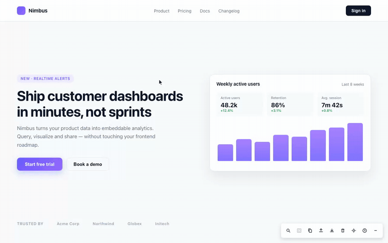

# web-remarq

Visual annotation tool for design review workflows. Framework-agnostic, zero dependencies.



Click any element on your running app and leave a comment - web-remarq fingerprints the element and (with a build plugin) resolves it to `file:line:column` in your source. From there, three ways to close the loop: hand the task to an AI coding agent over MCP, export a report for a developer, or sync it to your team via Supabase. Agents fix; humans verify - the verification gate is built into the annotation lifecycle.

## Packages

| Package | Description | |
|---------|-------------|---|
| [`web-remarq`](./packages/core) | Core library — browser annotation tool | [](https://www.npmjs.com/package/web-remarq) |
| [`@web-remarq/mcp`](./packages/mcp) | MCP server — gives AI agents (Claude Code, Cursor, ...) access to annotations; zero-config local mode | [](https://www.npmjs.com/package/@web-remarq/mcp) |
| [`@web-remarq/unplugin`](./packages/unplugin) | Universal plugin for Vite/webpack/Rollup/esbuild/Rspack (JSX + Vue SFC) | [](https://www.npmjs.com/package/@web-remarq/unplugin) |
| [`@web-remarq/babel-plugin`](./packages/babel-plugin) | Babel plugin for JSX source injection (React, Preact, Solid) | [](https://www.npmjs.com/package/@web-remarq/babel-plugin) |
| [`@web-remarq/swc-plugin`](./packages/swc-plugin) | SWC/WASM plugin for source injection (Turbopack) | [](https://www.npmjs.com/package/@web-remarq/swc-plugin) |
| [`@web-remarq/next`](./packages/next) | Next.js config wrapper — `withRemarq()` for webpack and Turbopack | [](https://www.npmjs.com/package/@web-remarq/next) |
| [`@web-remarq/cloud`](./packages/cloud) | Cloud storage adapter — sync annotations across team via Supabase | [](https://www.npmjs.com/package/@web-remarq/cloud) |
| [`@web-remarq/cli`](./packages/cli) | Installer and doctor - detects your stack, installs packages, prints the remaining edits, verifies the setup | [](https://www.npmjs.com/package/@web-remarq/cli) |

## Quick Start

Let your coding agent do it:

```bash
npx skills add DPostnik/web-remarq
```

Then tell it: **"set up web-remarq"**. It runs the installer, wires up your build
config and entry point, and verifies the result with `doctor`.

Prefer to drive yourself:

```bash
npx @web-remarq/cli init      # installs packages, writes .mcp.json, prints the remaining edits
npx @web-remarq/cli doctor    # checks the setup and explains what is wrong
```

On a plain HTML page with no bundler, `init` completes the whole setup on its own.

See each package's README for detailed docs.

## Usage scenarios

### 1. You + an AI agent (local, zero-config)

The flagship flow: you point at what's wrong on the page, your agent fixes it, you verify with one click. No account, no cloud, no env vars.

One-time setup (a Vue + Vite project as the example; React/Next work the same via the matching plugin):

```bash
npm i -D web-remarq @web-remarq/unplugin
```

```ts
// vite.config.ts — stamps data-remarq-source="src/components/Card.vue:24:6" (dev-only)
import remarq from '@web-remarq/unplugin/vite'
export default defineConfig({ plugins: [vue(), remarq({ include: ['src/**/*.vue'] })] })
```

```ts
// main.ts
import { WebRemarq, HttpStorageAdapter } from 'web-remarq'
if (import.meta.env.DEV) {
  WebRemarq.init({ submitFlow: true, storage: new HttpStorageAdapter() })
}
```

```json
// .mcp.json
{ "mcpServers": { "web-remarq": { "command": "npx", "args": ["-y", "@web-remarq/mcp"] } } }
```

The MCP server starts in local mode automatically: annotations live in `.remarq/annotations.json` (self-gitignored), served to the widget over `127.0.0.1`. Access is paired, not open: `.remarq/config.json` holds the project id and a random token; the Vite plugin hands the token to the widget in development, and the server accepts only listed browser origins. See the [`@web-remarq/mcp` README](./packages/mcp/README.md#access-model-mcp-050-protocol-2) for the model and its limits.

The daily loop:

1. **Annotate.** Run the dev server, hit Inspect in the toolbar, click the broken element, type what's wrong. Drafts collect quietly; press Submit to release them.
2. **Put the agent on duty.** In Claude Code, type `/mcp__web-remarq__watch`. The agent long-polls for feedback, acknowledges each annotation (marker turns yellow), hands the fix to a background subagent, and goes straight back to watching - fixes run in parallel, new feedback never waits.
3. **Or don't.** With no agent running, every actionable annotation is mirrored as a ticket file in `.remarq/tasks/<id>.md` - comment, source location, grep hints, and reporting instructions included. Later, tell any agent: "work through the tickets in `.remarq/tasks/`".
4. **Verify.** A blue marker means the agent claims a fix. Look at it: Verify (green, ticket disappears) or Reject with a reason (back to pending - the agent on duty picks it up again). Agents cannot verify their own work; that button is human-only.

#### Offline and durability

The toolbar's small dot says where your last change landed - and the states are never blurred together:

| Dot | State | Meaning |
|-----|-------|---------|
| green | `synced` | the server confirmed the write |
| orange, pulsing | `queued` | server unreachable; the change is in a per-project queue in localStorage and is replayed, in order, when the server is back - including after a reload |
| red | `memory` | localStorage unavailable too (quota, disabled); the change lives in this tab only and is lost on reload - you are told so |
| red | `unauthorized` | not paired: no token, a rotated token, or an origin the server does not allow; nothing is sent until fixed |
| red | `rejected` | the server refused a change as invalid; it is parked, not retried forever |
| orange | `conflict` | your change collided with a newer server copy (an agent moved it first); fields that could be kept were kept, the rest is journaled per project in localStorage and survives reloads until you export and clear it |

Rules that hold behind the dot: a queue only empties after the server confirms each operation; a stale local copy can never roll back a newer status or truncate history (writes carry revisions, collisions are merged three-way against the copy the edit was made from, which is stored with the queued change so a reload cannot turn a partial edit into an overwrite); a queue built for project A is never sent to a project B later served on the same port; a queue built before any server was ever seen is only sent after `WebRemarq.adoptUnsent()`; `WebRemarq.exportUnsent()` downloads everything that never reached the server, conflict records included (a conflict is written to the journal before the queued change is dropped, so a crash in between replays the change and replaces the record instead of losing it; when the journal itself cannot be written the change stays queued and the state says `memory`); `WebRemarq.getSyncStatus()` returns the state programmatically. Two tabs editing the same annotation do not lose changes silently: the second write is a detectable conflict. Imports are validated before anything is cleared and the previous store is backed up to `localStorage["remarq:import-backup"]`.

### 2. Designer → developer handoff (no server)

Nothing to run beyond the widget - annotations live in localStorage.

1. A designer annotates on staging, then exports JSON or copies the report as Markdown from the toolbar.
2. A developer imports the JSON - markers appear on the exact elements, viewport-aware; anything that no longer matches lands in a side panel instead of getting lost.
3. Or skip the human: `WebRemarq.copy('agent')` produces an agent-optimized export - source locations, prioritized grep queries with confidence levels, DOM context - ready to paste into any AI coding agent.

### 3. Team sync via Supabase

Same widget and MCP server, shared storage:

```bash
npx @web-remarq/cloud gen-key --name "my-project"   # prints pk_... and a SQL snippet
```

```ts
import { createCloudStorage } from '@web-remarq/cloud'
WebRemarq.init({
  storage: createCloudStorage({ supabaseUrl, supabaseAnonKey, projectKey: 'pk_...' }),
})
```

Everyone with the project key sees the same annotations (row-level security keyed by a hashed project key - the DB never stores the plaintext). The MCP server joins in cloud mode via `REMARQ_PROJECT_KEY` / `REMARQ_SUPABASE_URL` / `REMARQ_SUPABASE_ANON_KEY`. Details: [`@web-remarq/cloud`](./packages/cloud), [`@web-remarq/mcp`](./packages/mcp).

## Storage

`WebRemarq.init({ storage })` accepts any `StorageAdapter` implementation. Default is localStorage. See the [core package README](./packages/core/README.md#storage) for the interface and custom adapter examples. A Supabase-backed adapter for team collaboration ships separately as [`@web-remarq/cloud`](./packages/cloud).

## License

MIT
